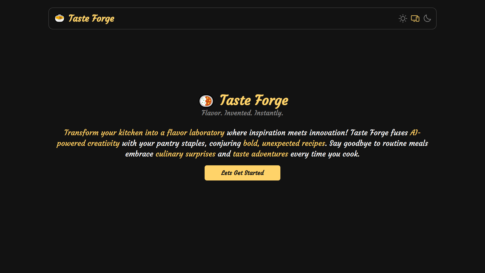
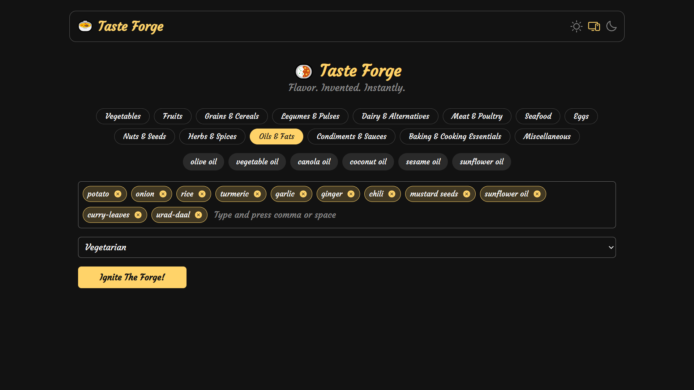

## TasteForge/README.md

# TasteForge

An AI-powered recipe generator: submit your available ingredients and get custom dish suggestions.  
Built with Next.js and Groq AI, featuring light/dark themes and predefined categories.

## Table of Contents

- [Features](#features)
- [Tech Stack](#tech-stack)
- [Screenshots](#screenshots)
- [Installation](#installation)
- [Running the App](#running-the-app)
- [Contributing](#contributing)
- [License](#license)

## Features

- 🤖 AI-driven recipe creation
- 🍽 Predefined recipe categories
- ✍️ Add ingredients via input field
- 🌗 Light & Dark theme toggle
- 💅 Beautiful, responsive UI

## Tech Stack

- **Framework:** Next.js
- **AI:** Groq AI
- **Styling:** Tailwind CSS
- **State:** React Context

## Screenshots

  


## Installation

```bash
# Clone and install
git clone https://github.com/thesujalpatel/TasteForge.git
cd TasteForge
npm install
```

## Running the App

```bash
# Start the development server
npm run dev
```

## Contributing

Contributions are welcome! Please fork the repository and submit a pull request with your changes.

1. Fork the repository
2. Create a new branch (`git checkout -b feature/YourFeature`)
3. Make your changes
4. Commit your changes (`git commit -m 'Add some feature'`)
5. Push to the branch (`git push origin feature/YourFeature`)
6. Open a pull request

## License

This project is licensed under the MIT License. See the [LICENSE](LICENSE) file for details.
